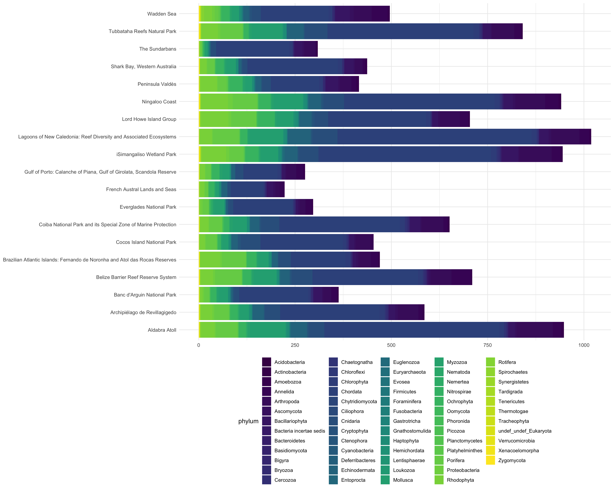

# Reading the eDNA dataset

## Reading occurrences

Read the individual Occurrence and DNADerivedData files, and join them:

    library(dplyr)
    library(stringr)
    library(purrr)

    dna_files <- list.files("../output", "*DNADerivedData*", full.names = TRUE)
    occurrence_files <- list.files("../output", "*Occurrence*", full.names = TRUE)

    dna <- map(dna_files, read.table, sep = "\t", quote = "", header = TRUE) %>%
      bind_rows() %>%
      mutate_if(is.character, na_if, "")

    occurrence <- map(occurrence_files, read.table, sep = "\t", quote = "", header = TRUE) %>%
      bind_rows() %>%
      mutate_if(is.character, na_if, "") %>%
      mutate(
        species = ifelse(taxonRank == "species", scientificName, NA),
        aphiaid = as.numeric(str_replace(scientificNameID, "urn:lsid:marinespecies.org:taxname:", ""))
      ) %>%
      left_join(dna, by = "occurrenceID")

## Resolving to accepted species

The PacMAN pipeline aligns taxa with WoRMS, but this may included
unaccepted taxa such as synonyms. Use the procedure below to resolve all
taxa to their accepted names. This can take a few minutes.

    library(worrms)
    library(furrr)

    resolve_to_accepted <- function(occurrence) {
      aphiaids <- unique(occurrence$aphiaid)
      aphiaid_batches <- split(aphiaids, as.integer((seq_along(aphiaids) - 1) / 50))
      plan(multisession, workers = 4)
      aphiaid_mapping <- future_map(aphiaid_batches, wm_record) %>%
        bind_rows() %>%
        select(aphiaid = AphiaID, valid_aphiaid = valid_AphiaID) %>%
        distinct() %>%
        filter(aphiaid != valid_aphiaid)
      
      valid_aphiaids <- unique(aphiaid_mapping$valid_aphiaid)
      valid_aphiaid_batches <- split(valid_aphiaids, as.integer((seq_along(valid_aphiaids) - 1) / 50))
      valid_taxa <- map(valid_aphiaid_batches, wm_record) %>%
        bind_rows() %>%
        select(valid_aphiaid = AphiaID, scientificName = scientificname, scientificNameID = lsid, taxonRank = rank, kingdom, phylum, class, order, family, genus) %>%
        mutate(taxonRank = tolower(taxonRank))
    occurrence %>%
      mutate(verbatimScientificName = scientificName) %>%
      left_join(aphiaid_mapping, by = "aphiaid") %>%
      rows_update(valid_taxa, by = "valid_aphiaid") %>%
      mutate(
        species = ifelse(taxonRank == "species", scientificName, NA),
        aphiaid = as.numeric(str_replace(scientificNameID, "urn:lsid:marinespecies.org:taxname:", ""))
      ) %>%
      select(-valid_aphiaid)
    }

    occurrence <- resolve_to_accepted(occurrence)

Inspect updated names:

    occurrence %>%
      filter(scientificName != verbatimScientificName) %>%
      group_by(scientificName, verbatimScientificName) %>%
      summarize(n = n()) %>%
      arrange(desc(n)) %>%
      head(10) %>%
      knitr::kable()

<table style="width:100%;">
<colgroup>
<col style="width: 54%" />
<col style="width: 35%" />
<col style="width: 10%" />
</colgroup>
<thead>
<tr class="header">
<th style="text-align: left;">scientificName</th>
<th style="text-align: left;">verbatimScientificName</th>
<th style="text-align: right;">n</th>
</tr>
</thead>
<tbody>
<tr class="odd">
<td style="text-align: left;">Animalia</td>
<td style="text-align: left;">Metazoa</td>
<td style="text-align: right;">607990</td>
</tr>
<tr class="even">
<td style="text-align: left;">Bellerochea polymorpha</td>
<td style="text-align: left;">Minutocellus polymorphus</td>
<td style="text-align: right;">1649</td>
</tr>
<tr class="odd">
<td style="text-align: left;">Azurina atrilobata</td>
<td style="text-align: left;">Chromis atrilobata</td>
<td style="text-align: right;">931</td>
</tr>
<tr class="even">
<td style="text-align: left;">Callyspongia (Cladochalina) plicifera</td>
<td style="text-align: left;">Callyspongia plicifera</td>
<td style="text-align: right;">640</td>
</tr>
<tr class="odd">
<td style="text-align: left;">Neoparamoeba aestuarina</td>
<td style="text-align: left;">Paramoeba aestuarina</td>
<td style="text-align: right;">584</td>
</tr>
<tr class="even">
<td style="text-align: left;">Coscinodiscophycidae</td>
<td style="text-align: left;">Coscinodiscophyceae</td>
<td style="text-align: right;">510</td>
</tr>
<tr class="odd">
<td style="text-align: left;">Platybelone argalus</td>
<td style="text-align: left;">Platybelone argala</td>
<td style="text-align: right;">428</td>
</tr>
<tr class="even">
<td style="text-align: left;">Acartia (Acanthacartia) tonsa</td>
<td style="text-align: left;">Acartia tonsa</td>
<td style="text-align: right;">386</td>
</tr>
<tr class="odd">
<td style="text-align: left;">Istiblennius edentulus</td>
<td style="text-align: left;">Istiblennius enosimae</td>
<td style="text-align: right;">336</td>
</tr>
<tr class="even">
<td style="text-align: left;">Sundstroemia setigera</td>
<td style="text-align: left;">Rhizosolenia setigera</td>
<td style="text-align: right;">314</td>
</tr>
</tbody>
</table>

## Data exploration

    library(ggplot2)

    stats <- occurrence %>%
      filter(!is.na(phylum) & !is.na(higherGeography)) %>%
      group_by(higherGeography, phylum) %>%
      summarize(n = n_distinct(species))

    ggplot() +
      geom_bar(data = stats, aes(y = higherGeography, x = n, fill = phylum), stat = "identity") +
      viridis::scale_fill_viridis(discrete = TRUE) +
      theme_minimal() +
      theme(legend.position = "bottom", axis.title = element_blank())

