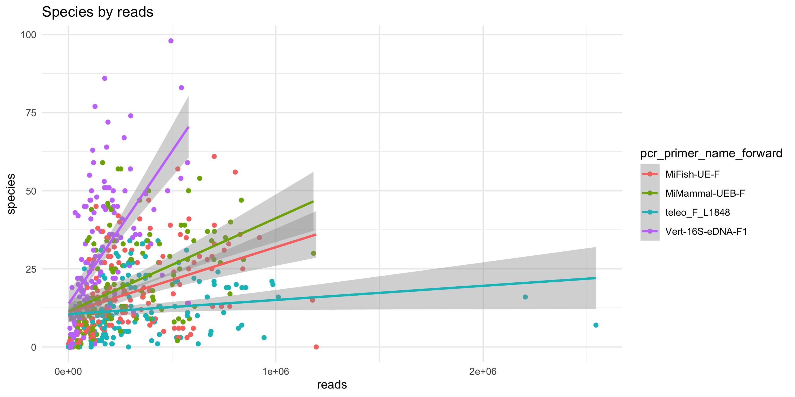
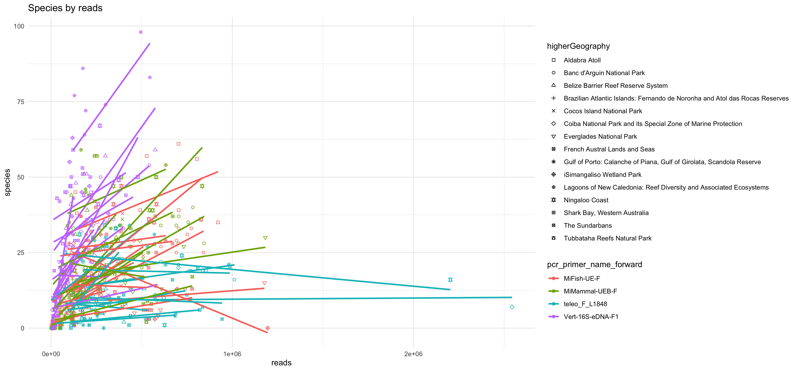
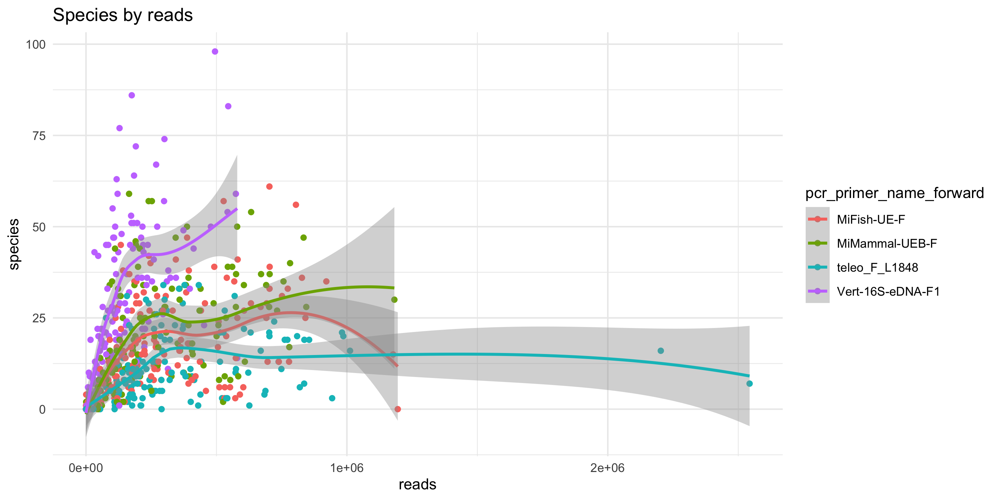
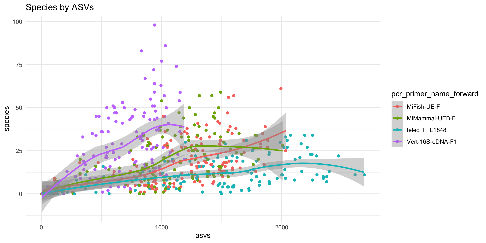

# eDNA data exploration

## Read dataset

    library(ggplot2)
    library(dplyr)
    library(purrr)

    dna_files <- list.files("../output", "*DNADerivedData*", full.names = TRUE)
    occurrence_files <- list.files("../output", "*Occurrence*", full.names = TRUE)

    dna <- map(dna_files, read.table, sep = "\t", quote = "", header = TRUE) %>%
      bind_rows() %>%
      mutate_if(is.character, na_if, "")

    occurrence <- map(occurrence_files, read.table, sep = "\t", quote = "", header = TRUE) %>%
      bind_rows() %>%
      mutate_if(is.character, na_if, "") %>%
      mutate(species = ifelse(taxonRank == "species", scientificName, NA)) %>%
      left_join(dna, by = "occurrenceID")

## Reads, AVSs, and species by marker

    stats <- occurrence %>%
      group_by(materialSampleID, pcr_primer_name_forward) %>%
      summarize(species = n_distinct(species, na.rm = TRUE), asvs = n(), reads = sum(organismQuantity))

### Linear

    ggplot() +
      geom_point(data = stats, aes(reads, asvs, color = pcr_primer_name_forward)) +
      stat_smooth(data = stats, aes(reads, asvs, color = pcr_primer_name_forward), method = "lm", geom = "smooth", formula = (y ~ x)) +
      theme_minimal() +
      ggtitle("ASVs by reads")

    ggplot() +
      geom_point(data = stats, aes(reads, species, color = pcr_primer_name_forward)) +
      stat_smooth(data = stats, aes(reads, species, color = pcr_primer_name_forward), method = "lm", geom = "smooth", formula = (y ~ x)) +
      theme_minimal() +
      ggtitle("Species by reads")

    ggplot() +
      geom_point(data = stats, aes(asvs, species, color = pcr_primer_name_forward)) +
      stat_smooth(data = stats, aes(asvs, species, color = pcr_primer_name_forward), method = "lm", geom = "smooth", formula = (y ~ x)) +
      theme_minimal() +
      ggtitle("Species by ASVs")

### Local polynomial

    ggplot() +
      geom_point(data = stats, aes(reads, asvs, color = pcr_primer_name_forward)) +
      stat_smooth(data = stats, aes(reads, asvs, color = pcr_primer_name_forward), method = "loess", geom = "smooth", formula = (y ~ x)) +
      theme_minimal() +
      ggtitle("ASVs by reads")

    ggplot() +
      geom_point(data = stats, aes(reads, species, color = pcr_primer_name_forward)) +
      stat_smooth(data = stats, aes(reads, species, color = pcr_primer_name_forward), method = "loess", geom = "smooth", formula = (y ~ x)) +
      theme_minimal() +
      ggtitle("Species by reads")

    ggplot() +
      geom_point(data = stats, aes(asvs, species, color = pcr_primer_name_forward)) +
      stat_smooth(data = stats, aes(asvs, species, color = pcr_primer_name_forward), method = "loess", geom = "smooth", formula = (y ~ x)) +
      theme_minimal() +
      ggtitle("Species by ASVs")

## Rarefaction curves

To do.
